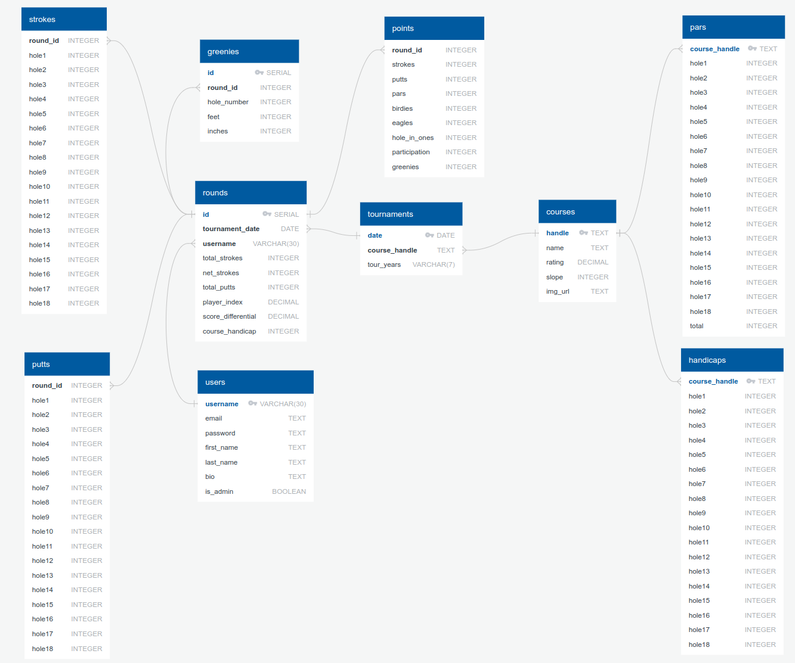

# Project Proposal

1. Tech Stack
   - React
   - Node
   - Express
   - PostgreSQL

2. Focus front-end or back-end
   - Evenly focuesed full-stack application
  
3. This will be a website that primarily functions as a mobile app for members of the contra costa golf club.

4. The goal of my project is to create an application that accepts user inputs of golf courses, tournaments, rounds, and greenies. All of the user-inputed data will be used to generate a points system that determines a yearly club champion.

5. The demographic of my users is golfers who play with the contra costa golf club.

6. The data will initially be pulled from an existing filemaker database. After the app is completed, all data will be gathered from user inputs. I will create my own API.

7. Approach Outline
   * Database Schema
   
   * Issue with API will be figuring out all the necessary data categories from an existing, unorganized filemaker pro application.
   * There is no sensative information I need to secure.
   * App functionality will include displaying all tournament scores, greenies, and points generated from that data. 
   * Users will be able to register and login. Admin users will be able to create, edit, and delete courses and tournaments. Regular users will be able to create, edit, and delete round scores and greenies. There will be no permissions for viewing any of the tournament, greenie, round, or course pages.
   * The stretch goal will be implementing the points system that determines a yearly winner on the basis of total points accrued based on factors like finishing positions, participation, individual hole scores (pars, birdies, ect.), and greenies.